<div align="center">

<!-- ============================================= -->
<!-- SECTION 1 — CUSTOM ANIMATED TERMINAL BOOT     -->
<!-- Hand-built SVG, not a generic badge generator -->
<!-- ============================================= -->



</div>

<br/>

<!-- ============================================= -->
<!-- SECTION 2 — HERO, styled as a neofetch output -->
<!-- ============================================= -->

<table>
<tr>
<td width="58%" valign="top">

```text
sujal@darsh-technosoft
-----------------------
OS:        Full-Stack Engineer
Host:      Darsh Technosoft (Trainee System Engineer)
Kernel:    ASP.NET · Node.js · Python
Shell:     C# / JavaScript
Uptime:    4+ yrs building things, 1 yr shipping them
Packages:  6 shipped projects, more brewing
Location:  Pune, Maharashtra, India
Focus:     AI Systems · Full Stack · Backend Engineering
```

I build practical software — not demos. AI-integrated CRMs, resume
intelligence engines, natural-language query builders, and legacy
enterprise systems that still need to work in production tomorrow.
That mix of "modern AI" and "old-school reliability" is where I
actually enjoy working.

📧 [your-email@example.com](mailto:your-email@example.com) &nbsp;·&nbsp;
🌐 [Portfolio](https://your-portfolio-link.com) &nbsp;·&nbsp;
💼 [LinkedIn](https://linkedin.com/in/your-profile) &nbsp;·&nbsp;
🐙 [GitHub](https://github.com/sujalkarawade)

</td>
<td width="42%" align="center">


<br/><br/>

`$ status --check`
<br/>


</td>
</tr>
</table>

<br/>

<!-- ============================================= -->
<!-- SECTION 3 — LIVE, hand-drawn skill radar chart -->
<!-- ============================================= -->

<div align="center">

## 📡 Skill Radar



<sub>A hand-built hexagon radar instead of a wall of badges — self-rated proficiency, refreshed as skills grow.</sub>

</div>

<br/>

<!-- ============================================= -->
<!-- SECTION 4 — TECH STACK, scan-friendly for ATS  -->
<!-- ============================================= -->

<details>
<summary><b>🛠️ Full Tech Stack (click to expand — kept here for recruiters & ATS parsers)</b></summary>
<br/>

**Languages**


**Frontend**


**Backend**


**Database**


**AI**


**Tools & Cloud**


</details>

<br/>

<!-- ============================================= -->
<!-- SECTION 5 — GITHUB STATS, compact dashboard    -->
<!-- ============================================= -->

<div align="center">

## 📊 Dashboard


</div>

<br/>

<!-- ============================================= -->
<!-- SECTION 6 — PROJECTS as an expandable file tree-->
<!-- ============================================= -->

<div align="center">

## 💼 Featured Projects

<sub>Rendered as a terminal file browser — click each directory to expand.</sub>

</div>

<br/>

<details>
<summary>📁 <b>clientsphere/</b> — AI-Powered CRM</summary>

```text
$ cat clientsphere/README.md
```
AI CRM built as a final-year capstone across two phases: full auth + client
CRUD with search/filtering, then an AI layer for lead scoring, sentiment
analysis, follow-up suggestions, an interaction timeline, an AI chat widget,
and a Recharts-powered leaderboard.

`React` · `Vite` · `Node.js` · `Express` · `PostgreSQL` · `Prisma` · `JWT`

[](https://github.com/sujalkarawade/clientsphere)
[](https://your-live-demo-link.com)

</details>

<details>
<summary>📁 <b>hireflow/</b> — AI Resume & JD Analyzer</summary>

```text
$ cat hireflow/README.md
```
Full-stack resume intelligence system: ATS scoring, a RAG chatbot over
resume + job-description embeddings, resume improvement suggestions,
interview question generation, and a personalized learning roadmap.
Containerized end-to-end with Docker Compose.

`React` · `Vite` · `Node.js` · `PostgreSQL + pgvector` · `Gemini AI` · `Docker`

[](https://github.com/sujalkarawade/hireflow)
[](https://your-live-demo-link.com)

</details>

<details>
<summary>📁 <b>forgeqbe/</b> — AI Query Builder</summary>

```text
$ cat forgeqbe/README.md
```
Converts natural-language requests into structured, validated database
queries — built to let non-technical users query production data safely
without hand-writing SQL.

`Python` · `FastAPI` · `SQL` · `LLM-assisted parsing`

[](https://github.com/sujalkarawade/forgeqbe)
[](https://your-live-demo-link.com)

</details>

<details>
<summary>📁 <b>legal-buddy/</b> — AI Legal Document Assistant</summary>

```text
$ cat legal-buddy/README.md
```
AI-assisted legal document platform: generates professional Indian-jurisdiction
templates (employment contracts, lease agreements, service agreements) via a
Node.js + docx pipeline, with a redesigned, recruiter-friendly UI.

`Node.js` · `docx` · `AI-assisted drafting`

[](https://github.com/sujalkarawade/legal-buddy)
[](https://your-live-demo-link.com)

</details>

<details>
<summary>📁 <b>code-review-chatbot/</b> — AI Code Reviewer</summary>

```text
$ cat code-review-chatbot/README.md
```
A chatbot that reviews source code, flags issues, and suggests concrete
improvements — built to shorten review cycles on small teams.

`Python` · `Hugging Face` · `REST API`

[](https://github.com/sujalkarawade/code-review-chatbot)
[](https://your-live-demo-link.com)

</details>

<details>
<summary>📁 <b>portfolio/</b> — Personal Portfolio Site</summary>

```text
$ cat portfolio/README.md
```
Personal developer portfolio — projects, skills, and experience, designed
to be the fast, clean, recruiter-friendly landing page behind the links
above.

`HTML5` · `CSS3` · `JavaScript`

[](https://github.com/sujalkarawade/portfolio)
[](https://your-live-demo-link.com)

</details>

<br/>

<!-- ============================================= -->
<!-- SECTION 7 — CURRENT FOCUS                      -->
<!-- ============================================= -->

<div align="center">

## 🌱 Currently Compiling

```diff
+ Agentic AI & autonomous agents
+ Large Language Models (LLMs)
+ Cloud computing
+ System design
+ Advanced .NET
+ Advanced SQL
```

</div>

<br/>

<!-- ============================================= -->
<!-- SECTION 8 — ACHIEVEMENTS                       -->
<!-- ============================================= -->

<div align="center">

## 🏆 Achievements


</div>

<br/>

<!-- ============================================= -->
<!-- SECTION 9 — DEV QUOTE                          -->
<!-- ============================================= -->

<div align="center">

## 💬 Compiler Says


</div>

<br/>

<!-- ============================================= -->
<!-- SECTION 10 — SPOTIFY                           -->
<!-- ============================================= -->

<div align="center">

## 🎧 Now Playing


</div>

<br/>

<!-- ============================================= -->
<!-- SECTION 11 — SNAKE ANIMATION                   -->
<!-- ============================================= -->

<div align="center">

## 🐍 Contribution Snake


</div>

<br/>

<!-- ============================================= -->
<!-- SECTION 12 — CONTRIBUTION SKYLINE               -->
<!-- ============================================= -->

<div align="center">

## 🏙️ Contribution Skyline


</div>

<br/>

<!-- ============================================= -->
<!-- SECTION 13 — SUPPORT ME                        -->
<!-- ============================================= -->

<div align="center">

## ☕ Support Me

<a href="https://www.buymeacoffee.com/sujalkarawade">
  
</a>

</div>

<br/>

<!-- ============================================= -->
<!-- SECTION 14 — CONNECT                           -->
<!-- ============================================= -->

<div align="center">

## 🤝 Connect

<a href="https://linkedin.com/in/your-profile"></a>
<a href="mailto:your-email@example.com"></a>
<a href="https://your-portfolio-link.com"></a>
<a href="https://twitter.com/your-handle"></a>

</div>

<br/>

<!-- ============================================= -->
<!-- SECTION 15 — FOOTER                            -->
<!-- ============================================= -->


<div align="center">

`$ echo "Made with ❤️ by Sujal Karawade"`

</div>
